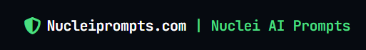
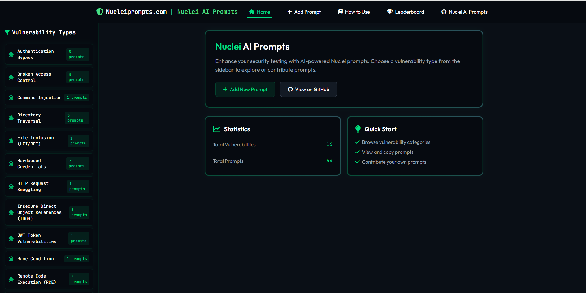
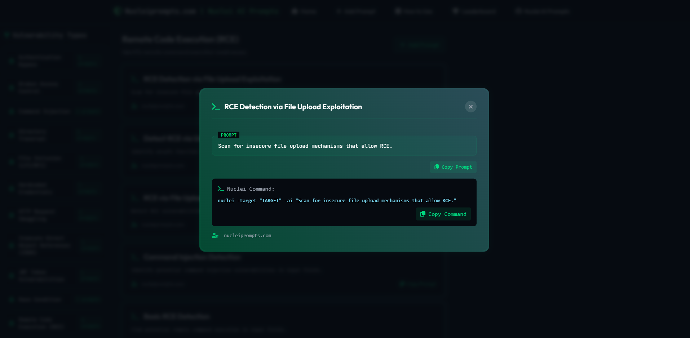

# Nuclei AI Prompts

  



  

Welcome to **nucleiprompts.com**, a collection of AI-powered security prompts for **Nuclei**, designed for penetration testers and security researchers.

  



  

🔗 **Visit the website:** [nucleiprompts.com](http://nucleiprompts.com)

  



## 📌 Categories & Prompts

### 🛠 XSS (Cross-Site Scripting)

```
1. Detect Basic XSS → Find common XSS patterns in response bodies.
2. Reflected XSS Detection → Identify reflected XSS vulnerabilities via GET parameters.
3. DOM-Based XSS Detection → Find DOM-based XSS vulnerabilities where user input is reflected inside JavaScript execution.
4. Stored XSS Finder → Identify stored XSS vulnerabilities where malicious scripts persist in the application.
5. Bypass WAF XSS Detection → Identify XSS vulnerabilities that bypass common web application firewalls.
6. Detect XSS in JavaScript Event Handlers → Scan for XSS vulnerabilities inside inline event handlers such as onmouseover, onclick.
```

### 💾 SQL Injection

```
1. Blind SQL Injection → Use time-based techniques to find blind SQL injection.
2. Error-Based SQL Injection → Check for error messages revealing SQL queries.
3. Union-Based SQL Injection Detection → Detect SQL injection vulnerabilities where UNION statements can be leveraged to extract data.
4. Boolean-Based Blind SQL Injection → Identify SQL injection vulnerabilities using boolean-based conditions.
5. Detect SQL Injection via Second-Order Attack → Identify second-order SQL injection vulnerabilities where input is stored and executed later.
6. Time-Based Blind SQL Injection → Detect SQL injection vulnerabilities using time delay techniques.
```

### 🖥 Remote Code Execution (RCE)

```
1. Basic RCE Detection → Find potential remote command execution in input fields.
2. Command Injection Detection → Identify potential command injection vulnerabilities in input fields.
3. RCE via File Upload → Detect RCE vulnerabilities through insecure file upload mechanisms.
4. Detect RCE via Unsafe Function Calls → Identify unsafe function calls that may lead to remote command execution.
5. RCE Detection via File Upload Exploitation → Scan for insecure file upload mechanisms that allow RCE.
```

### 📂 Directory Traversal

```
1. Directory Traversal Exploit → Detect sensitive files exposed via traversal attacks.
2. Detect ../ Directory Traversal → Identify directory traversal vulnerabilities allowing access to sensitive files.
3. Absolute Path Traversal → Find vulnerabilities where absolute file paths can be exploited for unauthorized access.
4. Detect Windows Path Traversal → Identify directory traversal vulnerabilities using Windows-style file paths.
5. Detect PHP File Inclusion via Traversal → Check for traversal vulnerabilities allowing PHP file inclusion.
```

### 🔓 Authentication Bypass

```
1. Weak Login Bypass → Identify login pages vulnerable to authentication bypass.
2. JWT Token Tampering Detection → Identify authentication bypass vulnerabilities due to weak JWT token implementations.
3. Weak API Key Exposure → Detect weak or publicly exposed API keys leading to authentication bypass.
4. Detect Authentication Bypass via JWT Manipulation → Scan for JWT vulnerabilities where authentication can be bypassed.
5. Check for Weak OAuth Implementations → Identify improperly configured OAuth authentication mechanisms.
```

### 🌐 Server-Side Request Forgery (SSRF)

```
1. Detect SSRF → Find SSRF vulnerabilities allowing remote server requests.
2. Open Redirect via SSRF → Identify SSRF vulnerabilities that allow open redirection to attacker-controlled servers.
3. Internal Port Scanning via SSRF → Detect internal port scanning vulnerabilities using SSRF payloads.
4. Detect SSRF via Header Injection → Identify SSRF vulnerabilities that exploit insecure header handling.
5. Find SSRF Exploitable Through Proxy Misconfiguration → Scan for SSRF vulnerabilities enabled due to misconfigured proxy servers.
```

### ⚙️ Security Misconfiguration

```
1. Find Security Misconfigurations → Scan for default credentials, exposed directories, and insecure headers.
2. Check for Default Credentials → Scan for applications running with default credentials left unchanged.
3. Insecure HTTP Headers Detection → Identify missing security headers such as CSP, X-Frame-Options, and HSTS.
4. Check for Publicly Accessible Admin Panels → Identify web applications exposing admin panels without authentication.
5. Detect Misconfigured Cloud Storage Buckets → Find cloud storage misconfigurations exposing sensitive data.
```

### 🔀 Race Condition

```
1. Detect Race Condition Issues → Identify vulnerabilities where multiple parallel processes can manipulate shared resources.
```

### 📡 XML External Entity (XXE)

```
1. Detect XXE Vulnerabilities → Identify XML External Entity attacks in web applications accepting XML input.
```

### 📁 File Inclusion (LFI/RFI)

```
1. LFI/RFI Detection → Check for Local and Remote File Inclusion vulnerabilities in file upload and inclusion mechanisms.
```

### 📥 HTTP Request Smuggling

```
1. HTTP Smuggling Detection → Find HTTP request smuggling vulnerabilities by testing different content-length and transfer encoding headers.
```

### 🔑 Hardcoded Credentials

```
1. Detect Hardcoded API Keys → Scan for exposed API keys in source code, configuration files, and logs.
2. Find Hardcoded Database Credentials → Identify hardcoded database usernames and passwords in backend source code.
3. Scan for Hardcoded SSH Private Keys → Detect SSH private keys left in public repositories or web directories.
4. Detect Exposed JWT Secrets → Identify hardcoded JSON Web Token (JWT) secrets that can be exploited for authentication bypass.
5. Find Hardcoded Cloud Provider Credentials → Scan for AWS, Google Cloud, and Azure credentials embedded in source files.
6. Scan for Hardcoded API Keys in Source Code → Detect hardcoded API keys left inside JavaScript, Python, and other language files.
7. Detect Hardcoded Passwords in Configuration Files → Scan for plaintext passwords stored in environment files and config files.
```

## 🚀 Contributing

We welcome contributions! If you have new security prompts or improvements, feel free to submit a pull request.

🔗 **Visit the website:**  [nucleiprompts.com](http://nucleiprompts.com)

📌 **GitHub Repo:**  [https://github.com/huseyinstif/Nuclei-AI-Prompts](https://github.com/huseyinstif/Nuclei-AI-Prompts)

## Contact

For any inquiries or further information, you can reach out to me through:

-   [LinkedIn](https://www.linkedin.com/in/huseyintintas/)
    
-   [Twitter](https://twitter.com/1337stif)